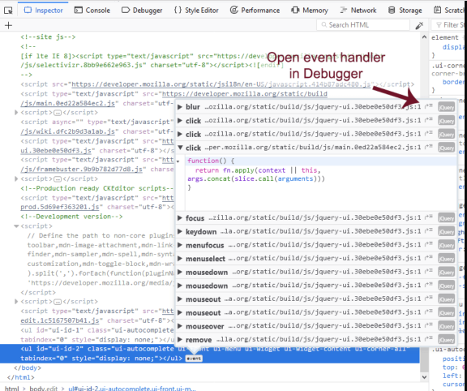
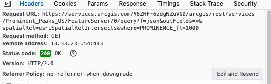
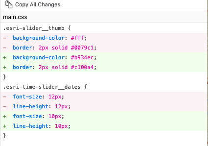
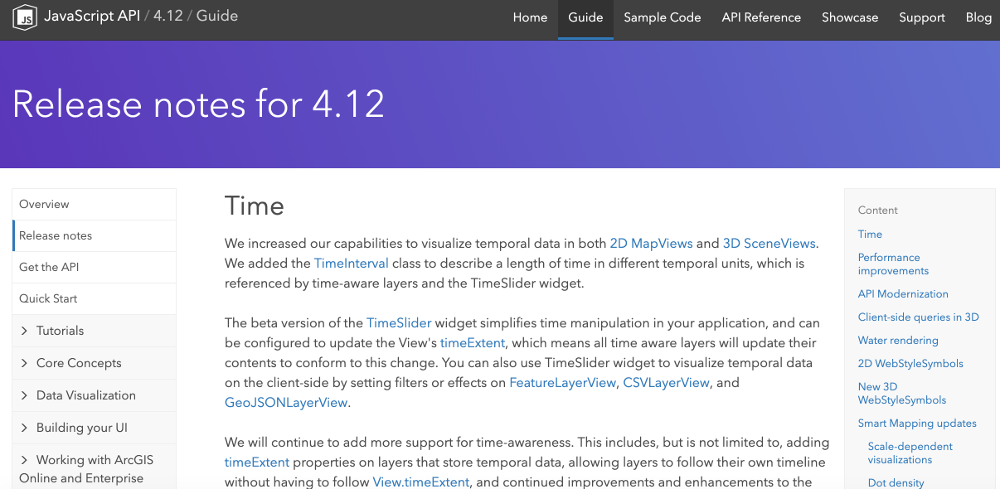
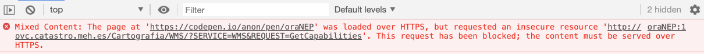
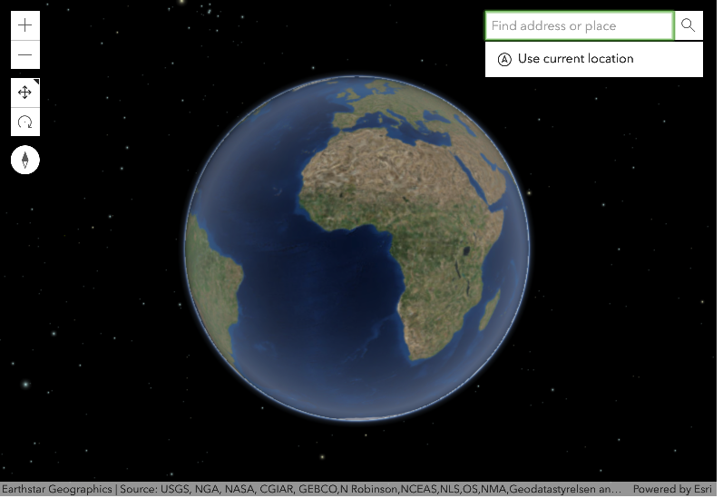

<!-- .slide: data-background="../reveal.js/img/bg-1.png" -->
<!-- .slide: class="title" -->
</br>
</br>
## Tips and Tricks for Developing and Debugging Apps
Kelly Hutchins and Heather Gonzago

----

### **Overview**
</br>


- Developer Setup
- Browser tools and tricks
- ArcGIS API for JavaScript tips


----

<!-- .slide: data-background="images/computer.jpeg" -->
</br></br>

<h1 style="text-shadow: 2px 2px #fff;color:#333;">Developer Setup</h1>

----

### **Web Server**

</br>


- IIS or Apache
- Lightweight http server
- Browser extensions

<aside class="notes">You may already have a web server installed visit http://localhost to test. If you don't have a web page setup Apache is pre-installed on mac and IIS is commonly used on windows. Alternatively you can setup a lightweight http server for testing. Lots of examples like http-server, Express and also browser extensions available.</aside>
----

### **Code Assist**
</br>
<a href="README.md" target="_blank">
  
</a>

- TypeScript
- JavaScript (Babel)

----

### **Emmet**
</br>
  <video style="float: right;"  width="600" height="400" controls>
   <source src="images/emmetdemo.mp4" type="video/mp4">
  </video>
<div>
  <ul>
    <li>Save keystrokes</li>
    <li>HTML, CSS abbreviations</li>
    <li>[Plug-in page](https://emmet.io/download/)</li>
  </ul>
</div>

----

### **Snippets**
</br>

  <video style="float:right;" width="600" height="400" controls>
   <source src="images/snippets.mp4" type="video/mp4">
  </video>

- Templates for common code
- Generate for VSCode, Sublime, Atom
- [Snippet generator](https://pawelgrzybek.com/snippet-generator/)
- Extensions for IDE to simplify
- [JSAPI Snippet extension](https://marketplace.visualstudio.com/items?itemName=Esri.arcgis-jsapi-snippets)

----

### **JSAPI Resources**

</br>
<a href="https://github.com/Esri/jsapi-resources" target="_blank">
  
</a>

- JSHint file
- TypeScript definition file
- Build tools, e.g. Bower
- OAuth Callback

----

### **Additional resources**


- <a href="https://odoe.net/blog/">odoenet</a>
- <a href="https://ralucanicola.github.io/code-snippets-arcgis-api-js/index.html">3D Code Snippets cheat sheet</a>
- <a href="https://github.com/Esri/arcade-expressions">Arcade expressions repo</a>

----
<!-- .slide: data-background="../reveal.js/img/bg-3.png" -->
</br></br>
## **Browser Dev Tools**

----

### **Browser Extensions **

- WhatFont
- JSON Viewer
- JavaScript and CSS Code Beautifier
- Awesome autocomplete for GitHub
- Wappalyzer
- Quick source viewer
- The list goes on and on …

----

### **Accessibility**

- Audits
- Color Contrast
- Extensions
- Axe Coconut (similar to Chrome Canary or Firefox nightly)
- Axe a11y extension
- ChromeVox screen reader

----

### **Console: Messages**
</br>
<a href="https://developers.arcgis.com/javascript/latest/sample-code/layers-featurelayer-collection/live/index.html" target="_blank"></a>
<div>
  <ul>
    <li>Log points</li>
    <li>Messages from JavaScript API</li>
  </ul>
</div>

----

### **Debugging: Firefox badges **

<a href="https://developers.arcgis.com/javascript/latest/sample-code/widget-timeslider/live/index.html" target="_blank">

</a>
<div>
<ul>
<li>Flex</li>
  <ul>
	<li>Flex container has dotted outline</li>
        <li>Solid lines show flex items</li>
        <li>Background pattern shows free space</li>
  </ul>
</ul>
<ul>
  <li>Event</li>
  <ul>
    <li>Elements with bound event listeners</li>
  </ul>
</ul>
</div>


----

### **Debugging: Pause code execution**

</br>
  

- Breakpoints
- Debugger;

----

### ** Debugging: Network requests**

- Records traffic
- Inspect headers and response

</br>
<a href="https://developers.arcgis.com/javascript/latest/sample-code/geoprocessing-viewshed/live/index.html" target="_blank">

</a>

----

### **Debugging: Network requests (Firefox)**

 [Edit and resend](https://developers.arcgis.com/javascript/latest/sample-code/tasks-query/live/index.html)



----

### **Debugging: CSS Inspection**
<a href="https://developers.arcgis.com/javascript/latest/sample-code/geoprocessing-viewshed/live/index.html" target="_blank">

<div>Inspect item finds info about:
<ul><li>CSS class names</li>
<li>Applied styles</li>
<li>Color contrast</li>
<li>Toggle pseudo element</li>
<li>Changes tab (firefox)</li>
</ul>

</div>

----


### **Other stuff**

</br>
<a href="https://developers.google.com/web/tools/chrome-devtools/device-mode/emulate-mobile-viewports" target="_blank">
  
</a>

- Mobile emulation
- Throttling
- Sensors - geolocation

----

<!-- .slide: data-background="../reveal.js/img/bg-3.png" -->
</br></br>
## **ArcGIS API for JavaScript FAQ**

----

### **Release Notes**
<a href="https://developers.arcgis.com/javascript/latest/guide/release-notes/index.html"></a>

----

### **Reading the API Reference**

<a href="https://developers.arcgis.com/javascript/latest/api-reference/esri-widgets-LayerList.html" target="_blank">

<aside class="notes">Do a deep dive into how to read the api ref here. Point out requires, beta tag?, since, autocast, hide/show inherited properties, samples and additional info. For widgets look at scss and view model links.</aside>

----

### **3.x to 4.x Feature Matrix**

<a href="https://developers.arcgis.com/javascript/latest/guide/functionality-matrix/index.html" target="_blank">
 
</a>
- Is this functionality in 4.x?
- 4.x equivalency in 3.x?

----

### **Module order matters**


<br>
<p>Console errors</p>


----

### **Mixed Content**

- Mixed content errors specific to http/https
- [Automatically switched](https://developers.arcgis.com/javascript/latest/guide/4.8/index.html#promote-secured-services)

<a href="https://codepen.io/anon/pen/oraNEP?&editable=true&editors=100" target="_blank">
</a><br></br><br></br>
<aside class="notes">Note: At 4.8 localhost was considered secure. This was changed at 4.9.</aside>

----

### **CORS and Proxy Guides**

 [CORS](https://developers.arcgis.com/javascript/latest/guide/cors/)<br>
 [Proxy](https://developers.arcgis.com/javascript/latest/guide/proxies/index.html)

----
### **Autocast**

</br>
<a href="https://developers.arcgis.com/javascript/latest/guide/autocasting/" target="_blank">
```
 var diamondSymbol = {
   type: "simple-marker",
   style: "diamond",
   color: [255,128,45],
   outline:{
     style: "dash-dot",
     color: [255,128,45]
   }
 };
```
</a>

----
### **Where did all the events go?**

</br>

- <a href="https://developers.arcgis.com/javascript/latest/guide/programming-patterns/#watching-for-property-changes" target="_blank">Watch properties</a>
    ```
    .watch(property, callback)
    ```
- Works with nested properties
    ```
    .watch("basemap.title",function(){})
    ```
- <a href= "https://developers.arcgis.com/javascript/latest/sample-code/sandbox/index.html?sample=watch-for-changes" target="_blank">Sample - Watch for changes</a>
- <a href="https://developers.arcgis.com/javascript/latest/api-reference/esri-core-watchUtils.html" target="_blank">watchUtils helper object</a>

----

### **Geolocation**

<a href="https://developers.arcgis.com/javascript/latest/sample-code/widgets-search-3d/index.html" target="_blank">
</a>


----

### **Troubleshooting Tips**

- Narrow the problem down
  - App specific
  - API specific
  - Server-side issue
  - Are any 3rd party resources involved?

----

<!-- .slide: data-background="../reveal.js/img/bg-3.png" -->
</br></br>
## **Questions???**

----


<!-- .slide: data-background="images/alias_slide.png" -->

----

<!-- SURVEY SLIDE: -->

<!-- .slide: data-background="../reveal.js/img/bg-5.png" -->
