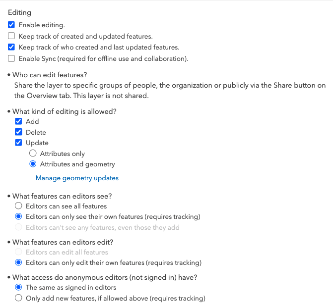
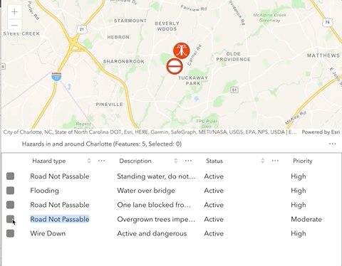
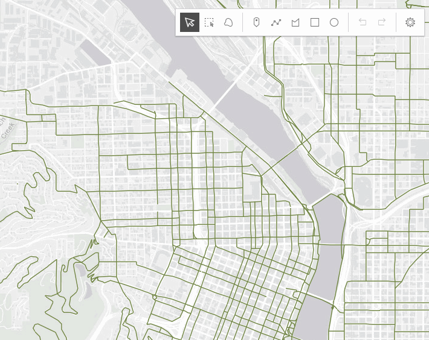

<!-- .slide: data-background="../reveal.js/img/2021/uc/bg-1.png" data-background-size="cover" -->

### ArcGIS API for JavaScript:

### Web Editing in 2D and 3D

#### Heather Gonzago

#### Jonathan Uihlein

#### Arno Fiva

---

### <small>Slides & demos: https://bit.ly/3itKZGD</small>

---

<!-- .slide: data-background="../reveal.js/img/2021/uc/bg-3.png" data-background-size="cover" -->

### **Agenda**

- Web Editing
- API widget editing
- 2d editing workflows
- 3d editing workflows

---

### **Editing in a feature service**

 

- <a href="https://developers.arcgis.com/rest/services-reference/feature-service.htm" target="_blank">Editable</a>
- One or more feature layers
- Users can draw, update, and/or create features

---

### **Constraints set at the service level**

 

- Can be configured in web clients
- Cannot override server-side permission levels
- Consistent behavior across all clients

---

### **Setting the feature layer's editable settings in AGO/Portal**

---

### **Edit a feature layer**

- <a href="https://developers.arcgis.com/rest/services-reference/feature-service.htm" target="_blank">ArcGIS REST API</a>
- <a href="https://doc.arcgis.com/en/arcgis-online/manage-data/edit-features.htm" target="_blank">ArcGIS Online</a>
- <a href="https://developers.arcgis.com/python/guide/editing-features/" target="_blank">ArcGIS API for Python</a>
- <a href="https://developers.arcgis.com/javascript/latest/api-reference/esri-widgets-Editor.html" target="_blank">ArcGIS API for JavaScript</a>

---

### **ArcGIS API for JavaScript**

 

🔑 Configurable widgets

⌨️ Granular APIs

---

### **Configurable Widgets**

 

- <a href="https://developers.arcgis.com/javascript/latest/api-reference/esri-widgets-Editor.html" target="_blank">Editor</a>
  - Geometry: <a href="https://developers.arcgis.com/javascript/latest/api-reference/esri-widgets-Sketch.html" target="_blank">Sketch</a>
  - Fields/attributes: <a href="https://developers.arcgis.com/javascript/latest/api-reference/esri-widgets-FeatureForm.html" target="_blank">FeatureForm</a>
  - <a href="https://developers.arcgis.com/javascript/latest/api-reference/esri-widgets-FeatureTemplates.html" target="_blank">FeatureTemplates</a>
  - <a href="https://developers.arcgis.com/javascript/latest/api-reference/esri-widgets-Attachments.html" target="_blank">Attachments</a>
- <a href="https://developers.arcgis.com/javascript/latest/api-reference/esri-widgets-FeatureTable.html" target="_blank">FeatureTable</a>

---

### [Editor](https://developers.arcgis.com/javascript/latest/api-reference/esri-widgets-Editor.html) widget

---

### [FeatureTable](https://developers.arcgis.com/javascript/latest/api-reference/esri-widgets-FeatureTable.html) widget

---

<!-- .slide: data-background="../reveal.js/img/2021/uc/bg-3.png" -->

### 2d Editing Workflows

#### Jonathan Uihlein

---

### **Recap: Configurable Widgets**

 

- <a href="https://developers.arcgis.com/javascript/latest/api-reference/esri-widgets-Editor.html" target="_blank">Editor</a>
  - Comprised of other widgets
    - <a href="https://developers.arcgis.com/javascript/latest/api-reference/esri-widgets-FeatureForm.html" target="_blank">FeatureForm</a> - Form based editing
    - <a href="https://developers.arcgis.com/javascript/latest/api-reference/esri-widgets-Sketch.html" target="_blank">Sketch</a> - Geometry based editing
  - Responsible for applying updates to the FeatureLayer
    - FeatureForm and Sketch are _client-side_

---

### **Form-based**

☝ `FeatureForm`

---

## [FeatureForm](https://developers.arcgis.com/javascript/latest/api-reference/esri-widgets-FeatureForm.html)

 

- Renders input fields from fields & attributes
- Configurable
  - Field order
  - Label/description
  - Groups
  - Visibility expression

---

### **FeatureForm demo**

- [(2020) Web Editing in 2D and 3D](https://www.youtube.com/watch?v=m0m7F8FuAlc) https://www.youtube.com/watch?v=m0m7F8FuAlc

---

### **Geometry-based**

☝ `Sketch`

---

### [Sketch](https://developers.arcgis.com/javascript/latest/api-reference/esri-widgets-Sketch.html)

- Used to modify feature geometries
- Provides two major workflows (or operations)
  - create
  - update (includes delete)
- Each workflow has a subset of available tools
  - e.g. 'point', 'polygon', 'rectangle', 'transform' 'reshape'
- Configurable options for both workflows
- Manages user interactions with the view internally
  - Can be disabled to provide more control directly to developers

---

### **Geometry-based Demos**

- [HelloWorld Sketch](https://developers.arcgis.com/javascript/latest/sample-code/sketch-geometries/index.html)
- [Custom Sketch tools](Demos/sketch-custom-tools/sketch-custom-tools.html)

---

<!-- .slide: data-background="../reveal.js/img/2021/uc/bg-3.png" data-transition="slide-in fade-out" -->

### Editing in 3D

#### Arno Fiva

---

<!-- .slide: data-transition="fade-in slide-out" -->

### Editing in 3D

- From 2D to 3D
- 3D feature layer editing applied
- Beyond feature layers

----

<!-- .slide: data-transition="slide-in fade-out" data-background-transition="none-out" -->

### From 2D to 3D

Editing works out-of-the-box also for `SceneView`

<!--
Carbon Template

https://carbon.now.sh/?bg=rgba%28171%2C184%2C195%2C0%29&t=vscode&wt=none&l=auto&ds=true&dsyoff=23px&dsblur=28px&wc=true&wa=true&pv=56px&ph=56px&ln=false&fl=1&fm=Hack&fs=14px&lh=133%25&si=false&es=2x&wm=false&code=%252F%252F%2520const%2520view%2520%253D%2520new%2520MapView%28%257B%250A%252F%252F%2520%2520map%253A%2520new%2520WebMap%28%252F*%2520...%2520*%252F%29%250A%252F%252F%2520%257D%29%253B%250A%250Aconst%2520view%2520%253D%2520new%2520SceneView%28%257B%250A%2520%2520map%253A%2520new%2520WebScene%28%252F*%2520...%2520*%252F%29%250A%257D%29%253B%250A%2520%2520%2520%2520%2520%2520%2520%2520%2520%2520%2520%2520%2520%2520%2520%2520%2520%2520%2520%2520%2520%2520%2520%2520%2520%2520%2520%2520%2520%2520%2520%2520%2520%250Aconst%2520editor%2520%253D%2520new%2520Editor%28%257B%250A%2520%2520view%253A%2520view%250A%257D%29%253B%250Aview.ui.add%28editor%252C%2520%2522top-right%2522%29%253B

-->

----

<!-- .slide: data-transition="none-out" data-background-transition="none" -->

### From 2D to 3D

Editing works out-of-the-box also for `SceneView`

----

<!-- .slide: data-transition="none" data-background-transition="none" -->

### From 2D to 3D

https://developers.arcgis.com/javascript/latest/sample-code/widgets-editor-basic/ <!-- .element style="font-size: 0.6em;" -->

----

<!-- .slide: data-transition="none" data-background-transition="none" -->

### From 2D to 3D

Geometries with z-values <!-- .element class="fragment" style="font-size: 0.8em;" -->

 <!-- .element class="fragment" -->

----

<!-- .slide: data-transition="none" data-background-transition="none" -->

### From 2D to 3D

`ElevationInfo` for visualizing data in 3D space

 <!-- .element class="fragment" style="border: solid 10px white;" -->
https://developers.arcgis.com/javascript/latest/sample-code/scene-elevationinfo/  <!-- .element style="font-size: 0.5em;" class="fragment" -->

----

<!-- .slide: data-transition="none" data-background-transition="none" -->

### From 2D to 3D

Symbology: `ObjectSymbol3DLayer` for volumetric shapes

https://developers.arcgis.com/javascript/latest/api-reference/esri-symbols-ObjectSymbol3DLayer.html <!-- .element style="font-size: 0.5em;" class="fragment" -->

----

<!-- .slide: data-transition="none" data-background-transition="none" -->

### From 2D to 3D

* `SceneView`
* Geometries with z-values
* `ElevationInfo` for visualizing data in 3D space
* Volumetric symbology

---

<!-- .slide: data-background="../reveal.js/img/2021/uc/bg-3.png" -->

## Slides and Demos

<a href="https://bit.ly/3itKZGD">https://bit.ly/3itKZGD</a>

---

<!-- .slide: data-background="../reveal.js/img/2021/uc/bg-3.png" -->

## Questions

---

<!-- .slide: data-background="../reveal.js/img/2021/uc/bg-4.png" -->

### **We want your feedback**

Click on the  
**Session Survey** link  
below this video window

---

<!-- .slide: data-background="../reveal.js/img/2021/uc/bg-6.png" -->
